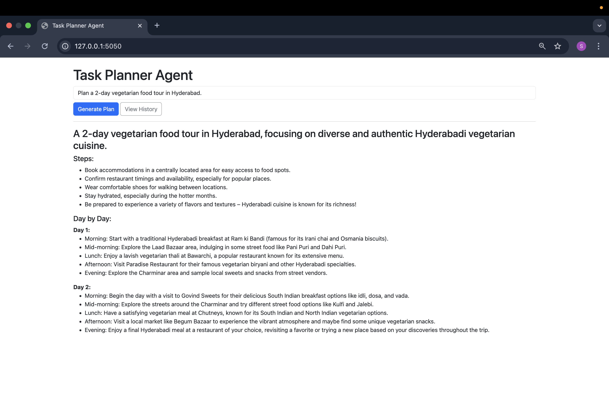
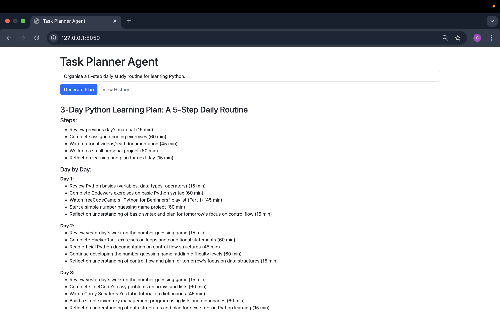
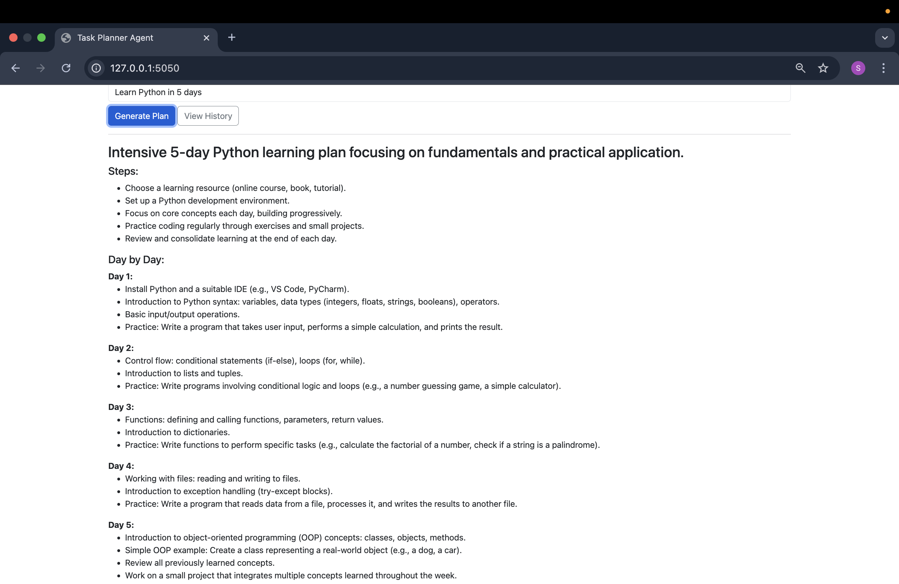
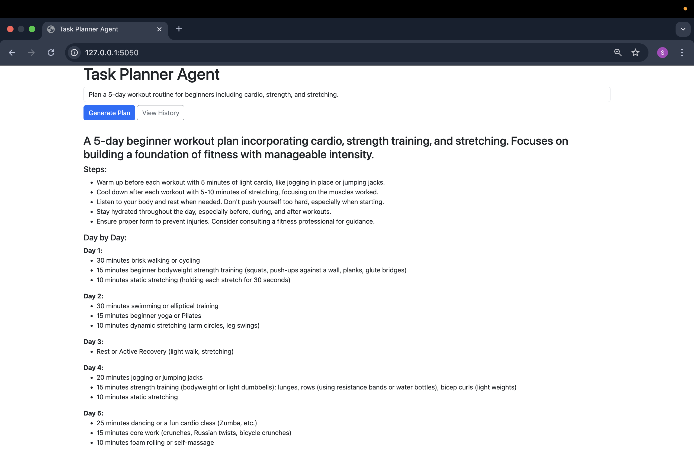
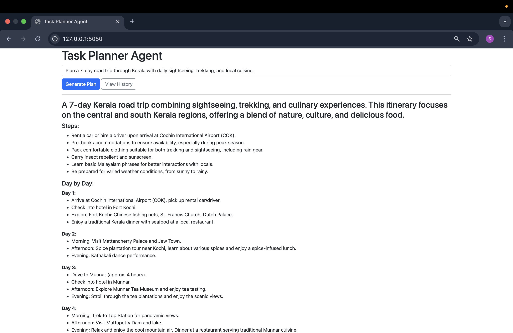

# Task Planner Agent

**Task Planner Agent** is an AI-powered assistant that turns natural language goals into actionable, day-by-day plans. It uses **Google Gemini AI** along with external APIs (web search and weather) to generate enriched plans. Generated plans are saved in a **SQLite** database and can be viewed later through a web interface.

---

## How It Works

1. **User input**: Enter a natural language goal, e.g., “Plan a 3‑day trip to Jaipur with cultural highlights and good food.”
2. **LLM planning**: Google Gemini AI breaks the goal into steps and day-by-day activities.
3. **External enrichment**:  
   - **Web search API** gathers relevant information (places, activities).  
   - **Weather API** provides forecasts to guide planning.
4. **Plan storage**: Each plan is saved in SQLite.
5. **Web interface**:  
   - Enter new goals  
   - View generated plans  
   - Browse past plans (history)  

**Workflow Diagram (conceptual):**  


---

## Features

- Generate plans for any number of days dynamically.  
- Provides **steps** and **day-by-day breakdown**.  
- Enriched with web search info and weather data.  
- **History storage**: Plans are saved in SQLite and can be viewed later.  
- **Clear history** functionality available in the web interface.

---

## Example Goals

- Plan a 2-day vegetarian food tour in Hyderabad  
- Organise a 5-step daily study routine for learning Python  
- Create a weekend plan in Vizag with beach, hiking, and seafood  
- Plan a 7-day learning schedule for Data Science (Pandas, NumPy, Matplotlib)  
- Organize a daily routine for writing a research paper in one week  
- Plan a 5-day workout routine for beginners (cardio, strength, stretching)  

**Example Plans (Screenshots):**  

**Hyderabad Food Tour:**  


**3-Day Python Learning Plan:**  


**5-Day Python Learning Plan:**  


**5-Day Beginner Workout Plan:**  


**7-Day Kerala Road Trip:**  


---

## Technology Used

- **Python** – Backend and AI integration  
- **Flask** – Web framework  
- **SQLite** – Database for storing plans  
- **Flask-SQLAlchemy** – ORM for database interaction  
- **Google Gemini AI** – LLM for generating plans  
- **SerpAPI** – Web search API  
- **OpenWeather API** – Weather forecasts for planning  
- **Bootstrap 5 & Jinja2** – Frontend UI  

---

## Setup & Installation

1. **Clone the repository**  
```bash
git clone https://github.com/sandalinatekarr/task-planner-agent.git
cd task-planner-agent
